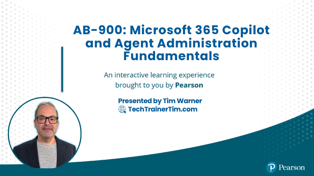

<div align="center">



# AB-900: Microsoft 365 Copilot and Agent Administration Fundamentals

**O'Reilly Live Learning course repository + AI-powered study buddy**

[](https://techtrainertim.com)
[](https://github.com/timothywarner)
[](https://techtrainertim.com)
[](./LICENSE)
[](https://learn.microsoft.com/credentials/certifications/exams/ab-900/)

</div>

This repository contains instructor materials for the O'Reilly Live Learning session on AB-900, plus an embedded GitHub Copilot study companion that generates exam-realistic practice questions, scenario walkthroughs, and personalized study plans.

---

## Quick Links

### AB-900 Certification

- [AB-900 Certification Page](https://learn.microsoft.com/credentials/certifications/exams/ab-900/)
- [AB-900 Study Guide](https://learn.microsoft.com/credentials/certifications/resources/study-guides/ab-900)

### Microsoft 365 Portals

- [Outlook](https://outlook.office.com)
- [Teams](https://teams.microsoft.com)
- [OneDrive](https://onedrive.live.com)
- [SharePoint](https://www.microsoft365.com/launch/sharepoint)
- [Excel](https://www.microsoft365.com/launch/excel)
- [Word](https://www.microsoft365.com/launch/word)

### Admin and AI Portals

- [Copilot Studio](https://copilotstudio.microsoft.com)
- [Azure AI Foundry Portal](https://ai.azure.com)
- [Microsoft Entra admin center](https://entra.microsoft.com)
- [Microsoft Defender XDR Portal](https://security.microsoft.com)
- [Microsoft Purview Portal](https://purview.microsoft.com)
- [Teams Admin Center](https://admin.teams.microsoft.com)
- [SharePoint Admin Center](https://admin.sharepoint.com)
- [Exchange Admin Center](https://admin.exchange.microsoft.com)
- [M365 Apps Admin Center](https://config.office.com)
- [Microsoft 365 Admin Center](https://admin.microsoft.com)

---

## Certification at a Glance

| Attribute | Value |
|-----------|-------|
| Exam code | AB-900 |
| Full title | Microsoft 365 Certified: Copilot and Agent Administration Fundamentals |
| Level | Beginner |
| Duration | 45 minutes |
| Passing score | 700 / 1000 |
| Exam page | https://learn.microsoft.com/credentials/certifications/exams/ab-900/ |
| Study guide | https://learn.microsoft.com/credentials/certifications/resources/study-guides/ab-900 |

### Exam Domains

| Domain | Weight |
|--------|--------|
| 1 -- Identify the core features and objects of Microsoft 365 services | 30-35% |
| 2 -- Understand data protection and governance for Microsoft 365 and Copilot | **35-40%** (highest) |
| 3 -- Perform basic administrative tasks for Copilot and agents | 25-30% |

---

## Quick Start: AB-900 Cert Buddy

The cert buddy is a GitHub Copilot agent that runs inside VS Code. It requires no installation beyond cloning this repo and having GitHub Copilot access.

### Setup (5 minutes)

1. Clone this repository:

   ```bash
   git clone https://github.com/timothywarner-org/ab900.git
   cd ab900
   ```

2. Open the folder in VS Code:

   ```bash
   code .
   ```

3. When prompted, install the recommended extensions (GitHub Copilot + GitHub Copilot Chat).

4. VS Code will prompt for a **Context7 API key** the first time a cert buddy command runs. Get a free key at https://context7.com and paste it when prompted. This enables version-specific M365 admin PowerShell and Graph API syntax lookups.

5. Open GitHub Copilot Chat (`Ctrl+Alt+I` / `Cmd+Alt+I`).

### Two Ways to Interact

**Option A -- Slash commands (guided input form):**

```
/ab900-practice-questions
/ab900-scenario-walkthrough
/ab900-study-planner
```

These open a guided form that collects inputs (domain, difficulty, confidence ratings, etc.) before generating content.

**Option B -- Direct agent mention (free-form):**

```
@ab900-cert-buddy-agent Give me a Domain 2 question about DSPM for AI at Apply level, medium difficulty.
@ab900-cert-buddy-agent Walk me through approving an agent submission in the M365 admin center.
@ab900-cert-buddy-agent Build me a study plan. I am weak on Domain 2 and moderate on the others.
```

---

## Cert Buddy Features

### Practice Questions

Questions use a **two-phase interactive delivery** that mirrors the real exam experience.

**Phase 1** -- The agent presents a workplace scenario and four answer choices (A-D), then stops and waits for your reply.

**Phase 2** -- After you answer, the agent reveals the correct answer, a 2-sentence rationale for every choice, and Microsoft Learn references.

Special commands during Phase 1:

| Command | Effect |
|---------|--------|
| `hint` | Eliminates one distractor |
| `skip` | Reveals the answer and moves to rationale |
| A / B / C / D | Your answer -- triggers Phase 2 |

After a set of questions the agent reports score, percent correct, and domains to review.

### Scenario Walkthroughs

Walkthroughs simulate the admin center experience without requiring a live tenant. Each walkthrough:

- Sets a realistic admin scenario (for example: "Contoso needs to see what sensitive data Copilot has been accessing")
- Walks through 5-10 numbered steps with exact portal URL, navigation path, and correct setting
- Flags the AB-900 exam objective each step covers
- Notes the most common wrong answers (wrong portal, wrong nav path, wrong role)

Available scenario types:

- Copilot licensing and pay-as-you-go billing configuration
- Agent approval workflow (M365 admin center + Power Platform admin center)
- DSPM for AI dashboard review
- SharePoint oversharing identification and remediation
- Sensitivity label creation and policy assignment
- DLP policy review and alert response
- PIM role activation and Conditional Access policy review

### Study Planner

1. The agent presents the three AB-900 domains with exam weights.
2. You rate your confidence in each: Strong / Moderate / Weak / Unknown.
3. The agent generates a prioritized study plan -- weakest first, Domain 2 flagged as highest weight.
4. Each domain entry includes estimated study hours, 2-3 Microsoft Learn module links, and key objectives.
5. The agent offers to start generating practice questions on your first priority domain.

---

## Repository Structure

```
ab900/
├── .github/
│   ├── agents/
│   │   └── ab900-cert-buddy-agent.agent.md    # Main Copilot agent
│   ├── skills/
│   │   ├── ab900-item-creator/SKILL.md         # Practice question generation
│   │   ├── ab900-scenario-walkthrough/SKILL.md # Admin scenario walkthroughs
│   │   └── ab900-study-planner/SKILL.md        # Personalized study plans
│   ├── prompts/
│   │   ├── ab900-practice-questions.prompt.md  # /ab900-practice-questions command
│   │   ├── ab900-scenario-walkthrough.prompt.md # /ab900-scenario-walkthrough command
│   │   └── ab900-study-planner.prompt.md       # /ab900-study-planner command
│   ├── copilot-instructions.md                 # Workspace Copilot grounding rules
│   └── workflows/
│       └── validate.yml                        # CI: terminology + link validation
├── .vscode/
│   ├── mcp.json                                # MCP server config (3 servers, auto-loads)
│   ├── extensions.json                         # Recommended extensions
│   └── settings.json                           # Workspace settings
├── references/
│   ├── ab900-objectives.md                     # Official exam objectives (all 3 domains)
│   ├── fictional-companies.md                  # Microsoft fictional companies for scenarios
│   └── style-guide.md                          # Microsoft Writing Style Guide extract
├── course-plan.md                              # Live session plan (4 x 50 min on ON24)
├── docs/
│   ├── module-01-security-foundations.md        # Module 1 CliffsNotes
│   ├── module-02-core-services-admin.md        # Module 2 CliffsNotes
│   ├── module-03-data-protection-governance.md  # Module 3 CliffsNotes
│   ├── module-04-copilot-and-agents.md         # Module 4 CliffsNotes
│   ├── module-05-copilot-admin-tasks.md        # Module 5 CliffsNotes
│   ├── module-06-agent-admin-tasks.md          # Module 6 CliffsNotes
│   ├── session-agenda.md                       # Instructor delivery guide (4 x 50 min)
│   ├── demo-scripts.md                         # Click-by-click scripts for all 14 demos
│   ├── tenant-setup-guide.md                   # Learner tenant setup before the session
│   ├── new-features-deep-dive.md               # DSPM for AI, Researcher, Analyst, PAYG
│   └── exam-traps-cheatsheet.md                # One-page last-minute cheat sheet
├── shared-resources/
│   └── references/
│       ├── AB-900-EXAM-GUIDE.md                # Complete exam reference
│       ├── AB-900-SKILLS-BREAKDOWN.md          # Per-objective study notes
│       └── AB-900-PRACTICE-QUESTIONS.md        # 15 practice questions (5 per domain)
└── segment-0{1-4}-*/                           # Per-segment demos, labs, slides, resources
```

---

## MCP Servers

Three MCP servers are configured in `.vscode/mcp.json` and load automatically on clone.

| Server ID | Purpose |
|-----------|---------|
| `ab900buddy-context7` | Version-specific M365 admin PowerShell, Graph API, and CLI syntax |
| `ab900buddy-markitdown` | Convert your own PDFs and Word docs to markdown for the agent to analyze |
| `ab900buddy-mslearn` | Search and fetch official Microsoft Learn documentation (`microsoft_docs_search`, `microsoft_docs_fetch`) |

The Microsoft Learn MCP server (`ab900buddy-mslearn`) is the primary source of truth for all generated questions and walkthroughs. It provides grounding in official Microsoft documentation directly from the workspace configuration.

---

## O'Reilly Live Learning Session

**Duration:** 4 segments x 50 minutes

| Segment | Topic | Domain |
|---------|-------|--------|
| 1 | Core Features and Objects of Microsoft 365 Services | Domain 1 |
| 2 | Data Protection and Governance for Microsoft 365 and Copilot | Domain 2 |
| 3 | Copilot Features and Administration | Domain 3 |
| 4 | Agent Administration and Exam Success | Domain 3 cont. |

### For Learners

Before the session:

1. Follow the [Tenant Setup Guide](./docs/tenant-setup-guide.md) to get a working M365 admin tenant.
2. Clone this repo and open it in VS Code.
3. Set up the cert buddy (see Quick Start above).

Key resources:

- [Exam Traps Cheat Sheet](./docs/exam-traps-cheatsheet.md) -- print or bookmark before the session
- [New Features Deep Dive](./docs/new-features-deep-dive.md) -- DSPM for AI, Researcher, Analyst, PAYG billing
- [Practice Questions](./shared-resources/references/AB-900-PRACTICE-QUESTIONS.md) -- 15 scenario-based questions

### For the Instructor

- [Session Agenda](./docs/session-agenda.md) -- full timing breakdown with cut guidance
- [Demo Scripts](./docs/demo-scripts.md) -- click-by-click scripts for all 14 demos
- [Tenant Setup Guide](./docs/tenant-setup-guide.md) -- what learners need before arriving

---

## Prerequisites

- Basic familiarity with Microsoft 365 services (email, SharePoint, Teams)
- Access to a Microsoft 365 tenant with Global Administrator rights -- see [Tenant Setup Guide](./docs/tenant-setup-guide.md)
- VS Code with GitHub Copilot for the cert buddy features
- No Azure infrastructure or data science experience required

---

## Key Admin Portal URLs

| Portal | URL |
|--------|-----|
| Microsoft 365 admin center | https://admin.microsoft.com |
| Microsoft Purview | https://purview.microsoft.com |
| Microsoft Entra admin center | https://entra.microsoft.com |
| Teams admin center | https://admin.teams.microsoft.com |
| Exchange admin center | https://admin.exchange.microsoft.com |
| Power Platform admin center | https://admin.powerplatform.microsoft.com |
| Copilot Studio | https://copilotstudio.microsoft.com |
| Copilot Dashboard | https://insights.viva.cloud.microsoft |

---

## About the Instructor

Timothy Warner is a Microsoft MVP and technology educator specializing in Microsoft 365, Azure, and AI.

## License

MIT License. See [LICENSE](./LICENSE).

## Support

Open an issue in this repository for questions about course materials.
